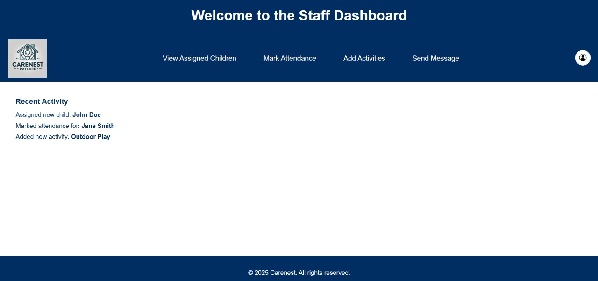
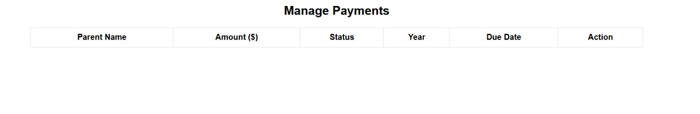

# 🏫 Carenest Daycare Management System

A complete web and mobile-based system for managing daycare operations including child attendance, staff-parent communication, monthly payments, and medical information.

---

## 📱 Features

- 👨‍👩‍👧 Admin can manage:
  - Staff, Parents, Children
  - Child photos, medical info, and allergies
  - Monthly payments
- 👩‍🏫 Staff can:
  - Mark attendance
  - Upload child-related updates
  - View schedules and communicate with parents
- 👪 Parents can:
  - View attendance & updates
  - Check payment status
  - Communicate with staff
- 💬 Messaging System
  - Send messages to individuals or groups (Admins, Parents, Staff)
- 💰 Monthly Payment Management

---

## 📷 Screenshots

### 🔐 Admin Dashboard

### 📝 Staff Dashboard

### 💵 Payment Page

---

## 💻 Tech Stack

| Tech         | Usage                    |
|--------------|--------------------------|
| HTML/CSS     | Frontend (Web)           |
| PHP          | Backend for Web App      |
| MySQL        | Relational Database      |
| Android (Java/Kotlin) | Mobile App      |
| MySQL Workbench | DB Design             |
| WAMP         | Localhost Web Server     |

---

## 🚀 Setup Instructions

### Web App Setup (with WAMP):

1. Place your project folder inside:
